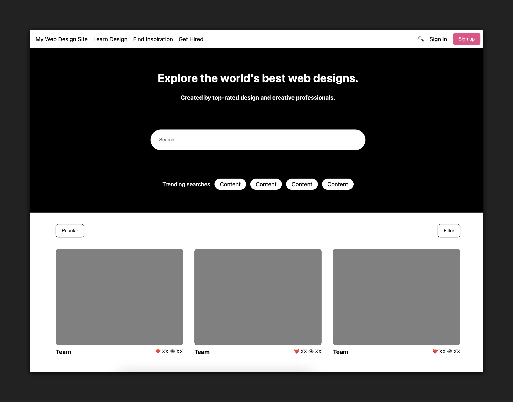

# 

## About

In this hands-on lab, students will have the opportunity to apply flexbox properties to layout a pre-styled web page. This lab will provide you with practical experience in using flexbox properties to create dynamic and responsive layouts, an essential skill for modern web development. 

## Time to complete

Estimated time to complete core lab exercise: **90 min**

## Content

- [Setup](../setup/README.md)
- [Exercise](../exercise/README.md)
