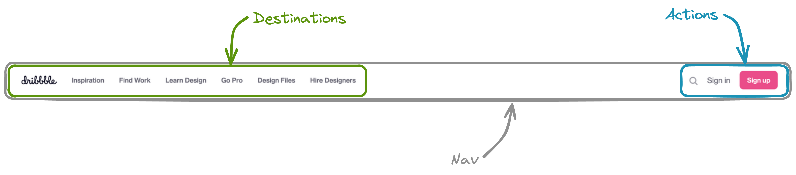
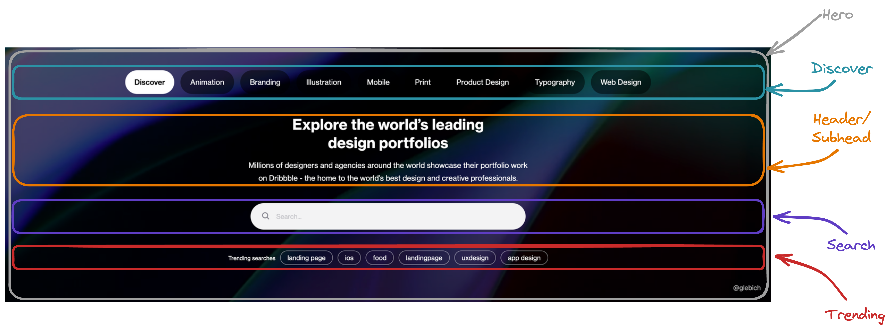
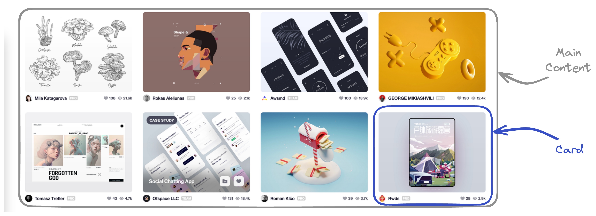

# 

## Introduction

This lab provides an opportunity to practice working with Flexbox by having you lay out pre-styled elements on a webpage.

### A quick note before you dive in

If you find yourself stuck during the lab, we encourage you to first revisit the lesson materials. They're designed to provide you with the information and examples that will help you complete the exercises. 

Specifically, recall these details from the lecture, they will help you build out this lab:

- Flexbox parents only directly influence their children.
- Flexboxes may be nested inside of one another.
- Keep in mind the default behavior of elements versus the behavior of elements when they are inside of a flexbox, and how you can control that behavior. You should be reference [the Complete Guide to Flexbox](https://css-tricks.com/snippets/css/a-guide-to-flexbox/) frequently to help guide you through this process.

It's important to note that this lab content is primarily focused on layout and appearance ***not functionality***. For example, items that would typically be links are instead paragraph elements.

Also, as a final point, this lab gave you some starting CSS - you should add your flexbox declarations to this existing starter when possible, but sometimes you might need to create new CSS rules to implement flexbox - that's encouraged.

If you've revisited the materials and are still facing challenges, don't hesitate to collaborate with your classmates.

Lastly, the internet is filled with resources specific to Flexbox. Websites like [Google](https://www.google.com/), [MDN Web Docs on Flexbox](https://developer.mozilla.org/en-US/docs/Learn/CSS/CSS_layout/Flexbox), [Stack Overflow](https://stackoverflow.com/search?q=flexbox), and especially [the Complete Guide to Flexbox](https://css-tricks.com/snippets/css/a-guide-to-flexbox/) are just a few clicks away. Use these before reaching out for help.

Happy coding!

## The final design

Start by evaluating where you want to go in this lab. The final product you build should look similar to this reference site:

Here's a link to this application so you can explore it on your own:

🌐 [Live site](https://pages.git.generalassemb.ly/modular-curriculum-all-courses/flexbox-lab-solution/)

## Approach

When constructing a complete website it can often be overwhelming and unproductive to build a layout for a complete website all at once. Instead, it will help to translate the final design into smaller sections that can each be worked on independently of one another. There are four distinct sections of this webpage:

- A nav bar.
- The hero content of the page - the main point of interaction on the page.
- A sub-nav for filtering and sorting the main content.
- The main content of the page.

This breakdown can be somewhat subjective, but the HTML structure of the page is often a good source of truth. You'll notice these four sections correspond directly with the four children elements of `<body>` element:

- The `<nav>` element corresponds to the nav bar.
- The `<section id="hero">` element corresponds to the hero content of the page.
- The `
` element corresponds to the sub-nav.
- The `<main>` element corresponds to the main content of the page.

Breaking a site like this down into distinct parts is the foundation of our work with a layout. What you're going to find with flexbox is that the process is ultimately just about putting boxes (elements) inside of other boxes (elements that are flexboxes). The rest of the lab will follow this breakdown, starting with the nav bar!

## Nav

Here's the completed nav bar:

Above is a dissection of the nav bar for the site. Looking at this we can broadly describe the items on the left side of the nav being ***destinations*** on the site and the items on the right of the nav as being related to user ***actions***.

> 🧠 As an aside this is a very, very common pattern across the internet and one that many users will instantly recognize. You can use this knowledge to improve the user experience of your own sites!

Use flexbox to get your nav bar looking like the completed example above. Here's some hints for you to help along the way:

- You'll turn the `<nav>`, `
`, and `
` elements into flexboxes. Note that this means that the `
`, and `
` will simultaneously be both flex children (of the `<nav>` element) and flex parents to their children elements.
- You'll need to research a method that could be used to create a gap between the different elements inside of the `
`, and `
`. [The Complete Guide to Flexbox](https://css-tricks.com/snippets/css/a-guide-to-flexbox/) may be helpful for this.
- Vertically centering the `destinations` and `actions` vertically in the nav bar may be tricky. Don't forget to break down problems step by step. 

## Hero section

On to our Hero section next. Let's do the same breakdown for this that we did for our nav bar:

> ❓ What's different about how the Hero section lays out its children compared to the nav?

Use flexbox to get your hero section looking like the completed example above. Just like you did with the nav bar, you'll need to nest a flexbox inside of another flexbox to get this to look correct. 

## Sub Nav

Here's the sub-nav!

Use flexbox to get your sub nav looking like the completed example above.

## Main Content

Time for the main event! Everything has lead up to this, and it's time to build the cards for the main content!

The main content is essentially just a scrolling list of cards for each piece of content, each with an image, and a footer showing some details about a piece of content.

Use flexbox to get your main content looking like the completed example above. Here's some hints for you to help along the way:

- The `<main>` tag will be a Flexbox that lays out its children in a row, and when they no longer fit on the row the children will wrap around to the next row. You'll need to consult the [Complete Guide to Flexbox](https://css-tricks.com/snippets/css/a-guide-to-flexbox/) to help with this.
- Note that the cards are vertically aligned to the center within the `<main>` element.
- Don't forget to turn the `
` element into a Flexbox that lays out its children in a row. Make its two children move to the edges of the container.
- You'll need to create a gap between the different `<article class="card">` elements (the children of the `<main>` element).

## Wrap up

Your site should be complete and your finished product should look something like this:

Congrats, you did it!!
