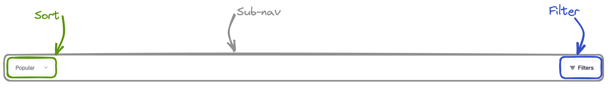
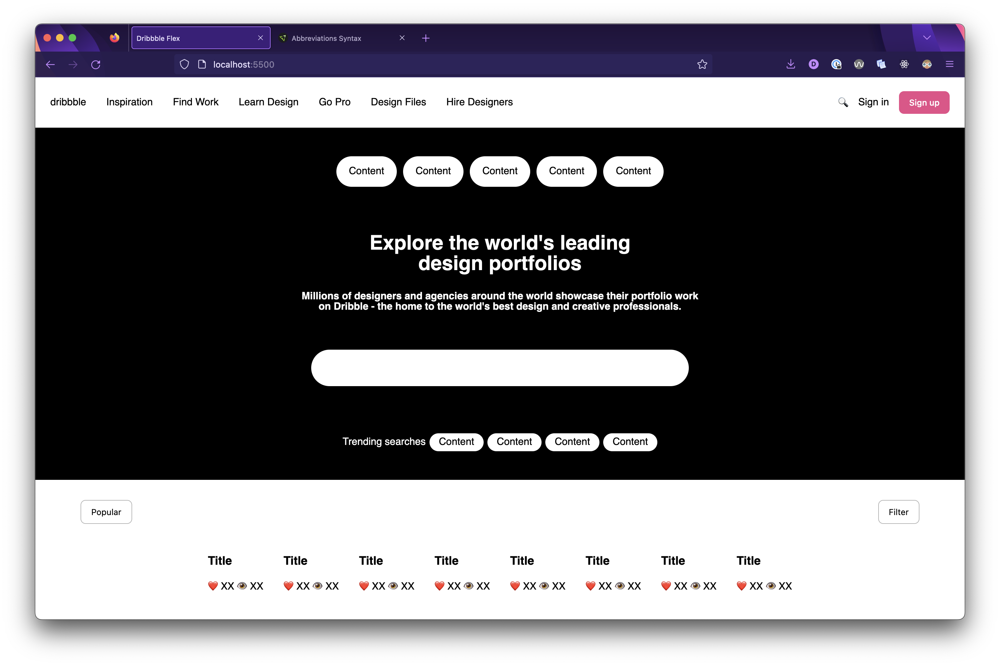
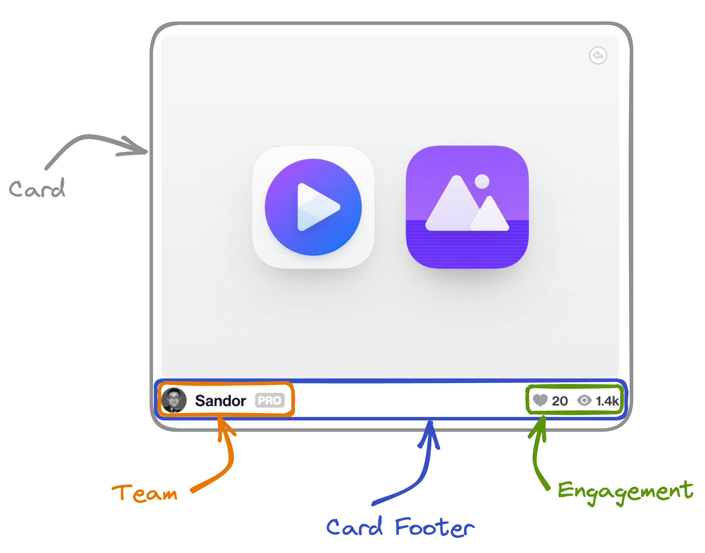
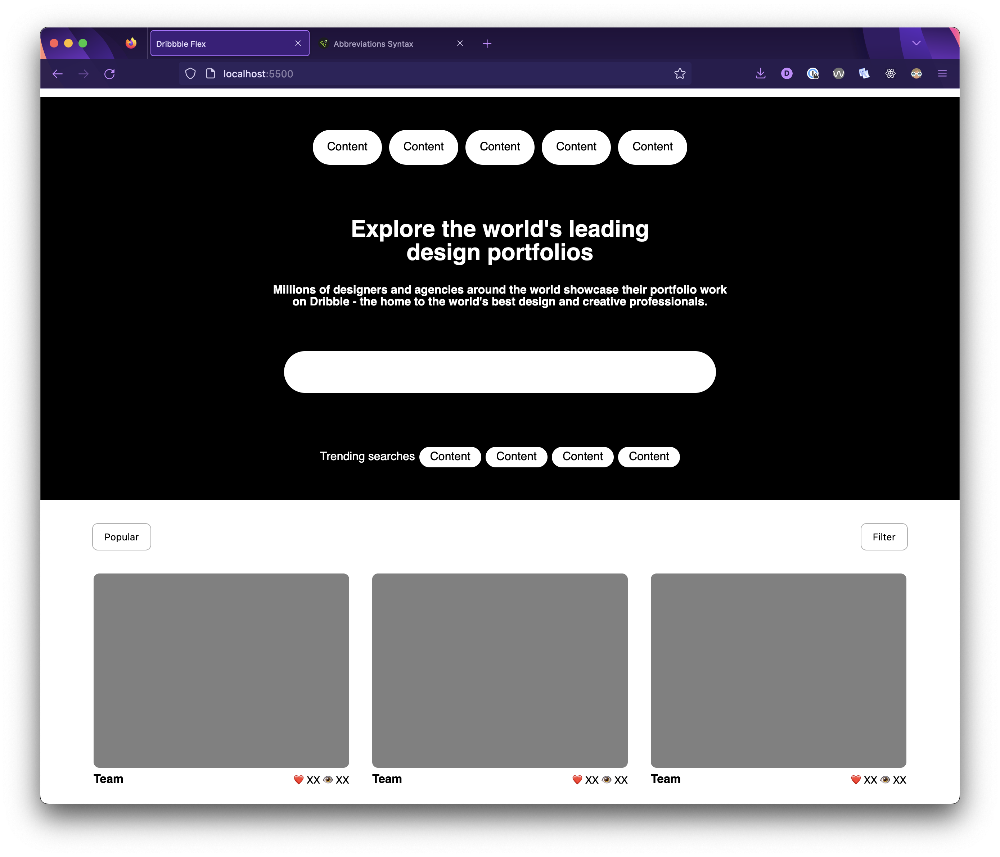

# 

## Introduction

This lab provides an opportunity to practice working with array iterator methods in JavaScript.

### A quick note before you dive in

If you find yourself stuck during the lab, we encourage you to first revisit the lesson materials. They're designed to provide you with the information and examples that will help you complete the exercises. 

If you've revisited the materials and are still facing challenges, don't hesitate to collaborate with your classmates.

Lastly, the internet is filled with resources specific to JavaScript arrays. Websites like [Google](https://www.google.com/), [MDN Web Docs on Flexbox](https://developer.mozilla.org/en-US/docs/Learn/CSS/CSS_layout/Flexbox), [Stack Overflow](https://stackoverflow.com/search?q=flexbox), and especially [the Complete Guide to Flexbox](https://css-tricks.com/snippets/css/a-guide-to-flexbox/) are just a few clicks away. Use these as a last resort, before reaching out for help.

Happy coding!

## Sub Nav

Here's the sub-nav!

# 

Time to tackle one on your own, build this one from start to finish. Implement both the filter and sort elements as buttons. Don’t forget, the [Complete Guide to Flexbox](https://css-tricks.com/snippets/css/a-guide-to-flexbox/) is there to help you!

## Main Content

Time for the main event! Everything has lead up to this, and it's time to build the cards!

# 

The main content is essentially just a scrolling list of cards for each piece of content, each with an image, and a footer showing the title of the card. Tons of these load in on the main page, but you can limit the number you're going to create to 8 for this lab.

When coding multiple elements try using shortcuts, like `copy/paste` or even an [emmet abbreviation](https://code.visualstudio.com/docs/editor/emmet) if you know the HTML structure you need and how many elements you want.

Build the `main` tag as a container that accomplishes the following tasks:

- Has a white background
- Is a Flexbox that lays out its children in a row, and when they no longer fit on the row they will wrap around to the next one. You'll need to consult the [Complete Guide to Flexbox](https://css-tricks.com/snippets/css/a-guide-to-flexbox/) to help with this.
- Gathers it’s children to the center vertically.
- Has an upper and lower padding of `32px` and a padding on both sides of `72px`.
- Has a `gap` of `32px` between each card element inside of it.

Your layout should look something like this after this step:

# 

And finally, style the layout of the cards themselves:

# 

- Make the `image-placeholder` a 355 pixel wide by 270 pixel tall rectangle, with a gray background representing where an image would be. **Definitely don’t worry about finding an image for this.** Also give it an 8 pixel border radius.
- Turn the `card footer` into a Flexbox that lays out its children in a row. Make its two children move to the edges of the container.
- Shrink the text down to 14 pixels for all the text inside of the `card footer`. Also change the margin of the text elements to be 8 pixels on top, and 0 pixels underneath.

Your finished product should look something like this:

# 

Congrats, you did it!!
