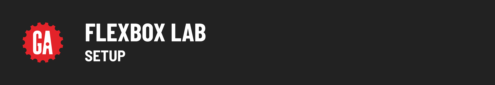
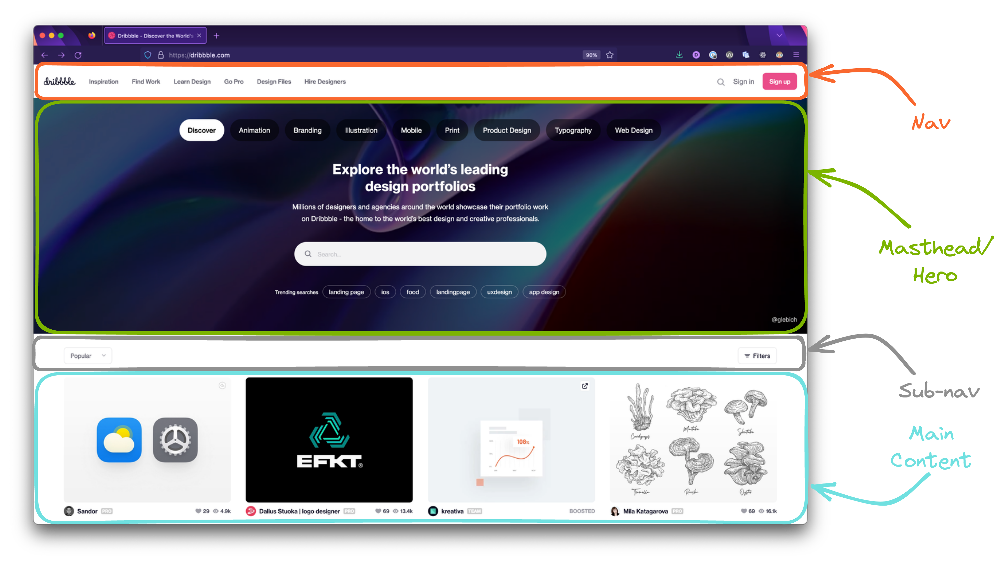

# 

## Setup 

Open your Terminal application and navigate to your `~/code/ga/labs` directory:

```bash
cd ~/code/ga/labs
```

Make a new directory called `js-arrays-lab`, then enter this directory:

```bash
mkdir flexbox-lab
cd flexbox-lab
```

Create a folder called `css`:

```bash
mkdir css
```

Then, create an `index.html` file and a `style.css` file that lives inside the `css` folder. These files will hold your work for this lecture:

```bash
touch index.html ./css/style.css
```

With the files created, open the contents of the directory in VS Code:

```bash
code .
```

Open the `index.html` file and add HTML boilerplate by typing `!` and then hitting the `Tab` key. Then make use of the `style.css` file by adding this line inside the `<head>` tag:

```html
<link rel="stylesheet" href="./css/style.css">
```

Add the following HTML inside the body:

```html
  <section class="flex-parent">
    <div class="flex-child" id="one">1</div>
    <div class="flex-child" id="two">2</div>
    <div class="flex-child" id="three">3</div>
    <div class="flex-child" id="four">4</div>
  </section>
```

Add the following to `css/style.css`:

```css
body {
  background-color: gray;
  font-family: sans-serif;
  margin: 0;
}

.flex-parent {
  background-color: black;
}

.flex-child {
  font-size: 48px;
}

#one {
  background-color: #f0f0f0;
  color: #707070;
}

#two {
  background-color: #d0d0d0;
  color: #505050;
}

#three {
  background-color: #b0b0b0;
  color: #303030;
}

#four {
  background-color: #909090;
  color: #101010;
}
```

Open the `index.html` file in your browser.

You should see something that looks like the following in your browser:


In the **Introduction to Flexbox** lesson we began to re-create an older version of the landing page for [**dribbble.com**](https://pages.git.generalassemb.ly/modular-curriculum-all-courses/intro-to-flexbox-reference-deployed/)!


Together we completed the `nav` and `hero` sections of the layout.



It is now up to you to complete the `sub nav` and `main` sections. To complete this lab, you'll need to set up a **new** repo.

Just like when we started this walkthrough together, there will be two options to create your new repo - either make a copy of the work we already have done so far, or fork and clone this repo containing the same code.

### Option 1: From Current Completed Code

If you want to create a new repo for this lab from the code that you already completed from the walkthrough, you'll need to do one of the following:

If you reset your code in your `lectures` repo, you'll need to make a copy of that `flexbox-intro` repo by running the following code to have a new repo in your labs directory:

<details>
  <summary>Copy from your <code>flexbox-intro</code> lecture repo</summary>

  ```bash
  cp -R ~/code/ga/lectures/flexbox-intro ~/code/ga/labs/intro-to-flexbox-lab
  ```
</details>

If you created a new lecture project repo named `flexbox-site`, you can run similar code to above, you'll just have to change the name of the repo you'd like to copy from `flexbox-intro` to `flexbox-site`. Run the following code:

<details>
  <summary>Copy from your <code>flexbox-site</code> lecture repo</summary>

  ```bash
  cp -R ~/code/ga/lectures/flexbox-site ~/code/ga/labs/intro-to-flexbox-lab
  ```
</details>

### Option 2: Fork and Clone this Repo

If you want to start completely fresh and create a new repo for this lab from the code directly **from this repo**, you can fork and clone it. that you already completed from the walkthrough, you'll need to do one of the following:

`Fork` this repo so that you have your own copy.

Using the link, clone the repo to your local machine and rename your directory to `intro-to-flexbox-lab`:

```bash
git clone https://git.generalassemb.ly/< your github username >/intro-to-flexbox-lab-starter-code.git intro-to-flexbox-lab
```

